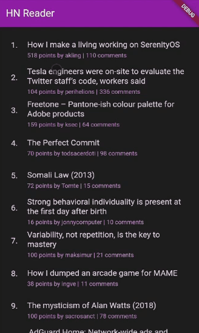

# HN Reader

HN Reader is a custom app for reading stories from [Hackernews](https://news.ycombinator.com/)<br>
It requires no additional permissions and currently does not support commenting only reading.



## Why

As a late night HN lurker the lack of "Dark Mode" options for mobile bugs me.
Additionally I always wanted a few extra features like caching stories + comments
in case the internet goes out. Extra goals include small stuff like how much time
I am spending on it.

## How
HN Reader is a Flutter based app that uses both [The Official HN API](https://github.com/HackerNews/API) and
[Angolia's HN API]( https://hn.algolia.com/api) for retrieving data.


## Goals
The goal of the project is to look and act as closely to the original Hackernews page as possible
and add small features like dark mode and story caching while being cross platform.

## TODO

- [ ] Create ShowHN / Poll Widgets for showing those story types
- [ ] Implement max depth for limiting comment trees
- [ ] Implement pagination for comments
- [ ] Add additional top stories after top 30 (currently only shows top 30)
- [ ] Update CommentWidget spacing to be more vertically dense


## Dev Stuff

Instructions for building / running the flutter app.

## To run locally
```
flutter run
```

## To build / deploy on Android
```
flutter build apk
```